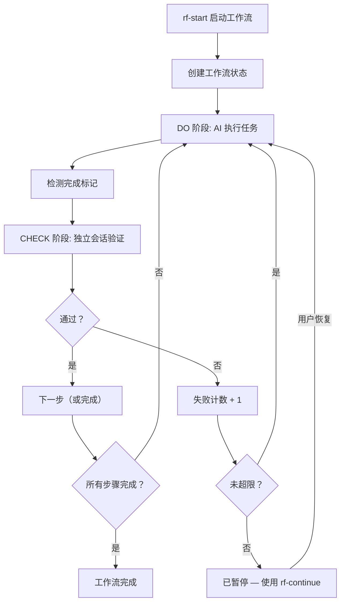
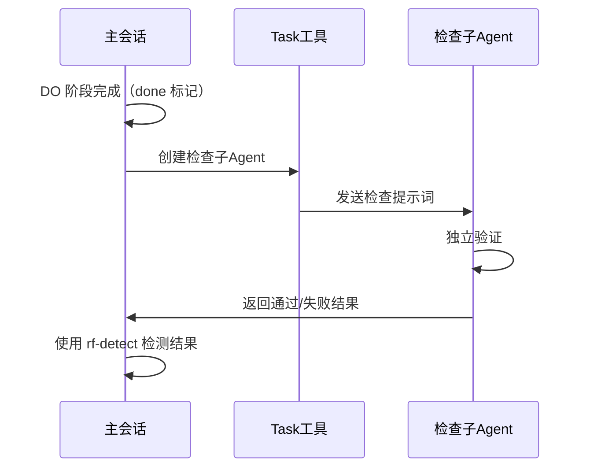

# 工作原理

本文档解释 ralpha-loop-workflow 的内部工作机制。

---

## 核心循环

每个工作流都遵循相同的基本循环：



### 阶段详解

**DO 阶段：**
1. AI 读取当前步骤的 `do` 提示词
2. AI 执行任务
3. 完成后，AI 输出 `<promise>done</promise>`
4. 使用 `rf-detect` 工具检测标记

**CHECK 阶段：**
1. 使用 Task 工具创建独立的子 agent
2. 子 agent 根据检查标准评估工作成果
3. 子 agent 返回 `<promise-check>true</promise-check>` 或 `<promise-check>false</promise-check>`
4. 使用 `rf-detect` 检测结果
5. 根据结果决定下一步

---

## 独立会话验证

CHECK 阶段使用**独立会话**来验证任务完成情况，避免自我审查偏差。



### 为什么使用独立会话？

- **无自我审查偏差** — 检查者没有实现过程的记忆
- **严格验证** — 仅根据检查标准判断，不受 AI "意图" 影响
- **干净的上下文** — 没有可能影响判断的累积上下文

---

## 多步骤流转

检查通过时，读取 `on_pass` 跳转到下一步的 DO 阶段；检查失败时读取 `on_fail` —— 可以重试当前步骤（携带失败上下文），也可以跳转到专门的修复步骤。

### 失败上下文

当步骤失败时，会捕获：
- 检查结果（失败原因）
- 当前失败次数
- DO 阶段的任何输出

这些上下文会注入到下一次 DO 阶段的尝试中，帮助 AI 从错误中学习。

---

## 标记检测

使用 `rf-detect` 工具扫描 AI 响应中的完成标记：

- `<promise>done</promise>` — DO 阶段完成
- `<promise-check>true</promise-check>` — CHECK 通过
- `<promise-check>false</promise-check>` — CHECK 失败

标记不区分大小写，允许空格变化。

---

## 状态管理

工作流状态存储在 `.trae/skills/ralpha-loop-workflow/state.json` 中：

```json
{
  "active": true,
  "workflow_name": "loop",
  "current_step": "loop",
  "current_phase": "do",
  "fail_count": 0,
  "user_task": "用户任务描述",
  "paused": false,
  "last_failure_reason": null,
  "start_time": "2026-06-17T10:30:00"
}
```

此文件由工具自动管理，不应手动编辑。

---

## 文件结构

所有生成文件统一放在 `.trae/skills/ralpha-loop-workflow/` 目录下：

```
.trae/skills/ralpha-loop-workflow/
├── SKILL.md              # Skill 定义文件
├── state.json            # 工作流状态
├── tools/                # 自定义工具
│   ├── rf-start/         # 启动工作流
│   ├── rf-status/        # 查看状态
│   ├── rf-continue/      # 恢复工作流
│   ├── rf-cancel/        # 取消工作流
│   ├── rf-list/          # 列出工作流
│   └── rf-detect/        # 检测标记
├── workflows/            # 工作流定义
│   ├── loop.yaml         # 内置：自动循环
│   └── spec.yaml         # 内置：规范驱动流水线
├── artifacts/            # spec 工作流生成的构件
│   ├── proposal.md
│   ├── specs.md
│   ├── design.md
│   ├── tasks.md
│   ├── verification.md
│   └── summary.md
├── logs/                 # 执行日志
│   └── cancellation-*.json
└── docs/                 # 文档
    ├── README_CN.md
    ├── commands_CN.md
    ├── custom-workflows_CN.md
    └── how-it-works_CN.md
```

### 关键文件

| 文件 | 说明 |
|------|------|
| `SKILL.md` | Skill 定义文件，包含工作流执行规则 |
| `state.json` | 工作流状态（当前步骤、阶段、失败次数）。**不要手动编辑。** |
| `workflows/` | 工作流 YAML 文件。内置 `loop.yaml` 和 `spec.yaml`。 |
| `artifacts/` | spec 工作流生成的构件。 |
| `logs/` | 执行日志。 |

---

## 与 opencode 版本的差异

### 架构差异

| 方面 | opencode 版本 | trae-cn 版本 |
|------|--------------|-------------|
| 运行方式 | 插件 | Skill |
| 事件驱动 | 自动监听 session.idle | 手动工具调用 |
| 独立验证 | API 创建会话 | Task 工具创建子 agent |
| 状态格式 | Markdown frontmatter | JSON |
| 子工作流 | 支持嵌套（最多5层） | 当前不支持 |

### 使用方式差异

**opencode 版本：**
- 自动事件驱动，AI 完成响应后自动检测标记
- 自动创建独立验证会话
- 自动推进工作流

**trae-cn 版本：**
- 需要手动调用工具
- 使用 Task 工具创建子 agent 进行验证
- AI 根据工具返回结果决定下一步

### 功能对应

| opencode | trae-cn |
|----------|---------|
| `/ralphflow-start` | `rf-start` 工具 |
| `/ralphflow-status` | `rf-status` 工具 |
| `/ralphflow-continue` | `rf-continue` 工具 |
| `/ralphflow-cancel` | `rf-cancel` 工具 |
| `/ralphflow-list` | `rf-list` 工具 |
| 自动标记检测 | `rf-detect` 工具 |
| 自动创建检查会话 | Task 工具 + 子 agent |
